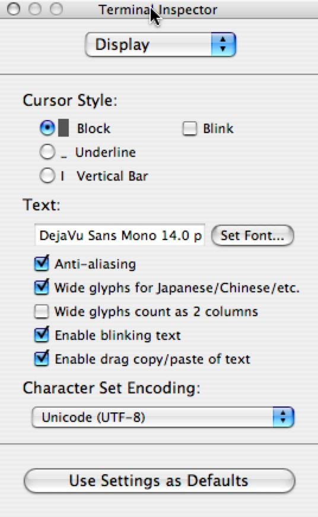
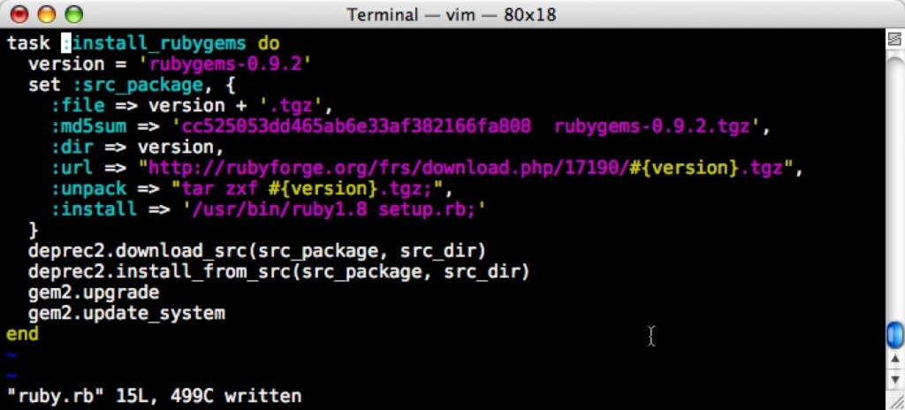

A couple of days I updated the font settings in terminal.app on my mac. It's now in line with textmate using Anti-Aliased 14 point [DejaVu Sans mono](http://dejavu.sourceforge.net/wiki/index.php/Download).

I think you'll agree, it's pretty.

Now I want to get my vim syntax highlighting to mirror that in Textmate. My vim
doesn't currently understand rhtml. I also want it to use the same colorscheme
(Sunburst) that my Textmate is using.**Who will join my quest**?

**update** big response from [the](http://groups.google.com/group/melbourne-ruby) [lists](http://groups.google.com/group/rails-oceania).

Install [rails.vim](http://www.vim.org/scripts/script.php?script_id=1567) so it will recognize .rhtml files. It also touts "easy file navigation, enhanced syntax highlighting, and more"

Install [vividchalk.vim](http://www.vim.org/scripts/script.php?script_id=1891), a colorscheme like Vibrant Ink for Textmate. Apparently it has a 16 color mode for remote terminal support. I still want to find Sunburst but at least I could always make one based on this.

The Rails Wiki has a page on [HowtoUseVimWithRails](http://wiki.rubyonrails.org/rails/pages/HowtoUseVimWithRails)

**Stay tuned!**
