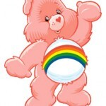

[UPDATE] In response to feedback from friends I'm referring to the blogger as Rainbow Bear (Bo).

A week ago I wrote to the author of one of my favourite blogs with concerns
about [an image they had
posted](http://www.savingpets.com.au/2011/08/hysteria-doesnt-help-solve-our-dog-problems/)
with the caption "A pit bull boxer cross'. This was just days after the
Victorian Govt. announced it was setting up their 'Dob in a Dangerous Dog'
hotline in preparation for a search and destroy mission for pit bulls and pit
bull crosses based purely on appearance. The dog in the picture did not look
like an American Pit Bull Terrier.  I asked that he remove the photo from his
 blog because it may endanger similar looking dogs.

> Hi Bo,

> 
> as you know, innocent family pets risk being seized and killed in Victoria
> due to their appearance. Dog without any 'pit bull' in them are already
> suffering because Authorized Officers think they resemble a pitbull cross.

> 
> You have published a photo with the caption "A pit bull boxer cross".
> 
>   * How do you know the genetic origins of that dog?
>	
>   * Given many dogs without 'pit bull' in may have a similar appearance to that dog, how can you justify putting them at risk by allowing it to remain on your site?
> 
> Please do not post pictures claiming to be 'pit bull crosses' as this may end up hurting dogs. Please also remove the one you've got up there.
> 
> I'm happy to discuss if you disagree but please don't continue to ignore my request for you to remove this image.
> 
> **Mike Bailey**
> 
> 
> 
> 
> 
> PO Box 2016
Fitzroy VIC 3065
[mike@goodfordogs.org](mailto:mike@goodfordogs.org)
[www.goodfordogs.org](http://www.goodfordogs.org/)

## A Week Later Rainbow Bear Responded, By Blog Post

A week passed without a response from Bo. Today I noticed he had put together a
blog post on his blog defending their refusal to remove the image.

[caption id="attachment_408" align="alignleft" width="150" caption="Picture changed for privacy reasons"][/caption]

"I chose the image of a smiley, bright eyed, well-behaved dog, BECAUSE it was a
smiley, bright eyed, well-behaved dog. We need to have more of these images to
call upon, not less if we’re ever to overcome the ignorant, misguided
aspersions generated by media hype and demonisation."

He then went on to put words in my mouth,

"Much better, they feel, that we hide all references to pit bulls for fear of making the situation worse."

## Promoting Positive Images of _Actual_ Pit Bulls

Posting positive images of American Pit Bull Terriers is a great idea. The
difference is that sites promoting positive images of Pit Bulls tend to use
dogs who at least look like APBTs.

The Victorian Govt is gearing up Council Officers to seize and destroy family
pets based on appearance. They're saying they will declare dogs who fit the new
id standard even if they're obviously not purebred APBTs. Don't put dogs
without any pit bull in them in the firing line by posting photos claiming to
be Pit Bull crosses.

## Weigh Up The Risks and Benefits

It's naive to think you can change public perception when an issue is as hot as
this. The media and government responded swiftly and in unison following the
tragic death of Ayen Chol.

Conversely, posting images of cross bred dogs and saying "there's one" may well
lead to people worrying about their own dog or dobbing in their neighbours.
We're gearing up for the witch hunts over here.

**Don't Give Council Workers More Ammo**

Regardless of the genetic history of that dog, I don't believe posting photos
of alleged Pit Bull **crosses** is responsible. It's not possible to determine
the genetic history of a mixed breed dog by visual examination but this is what
our Government is telling Council Officers to do. Don't give them more ammo.
