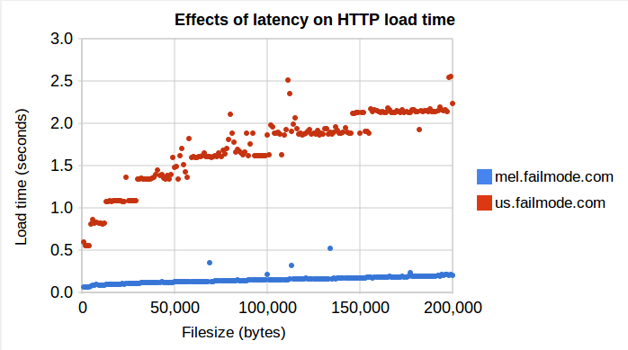

If you're hosting your website overseas you might want to rethink. I've been
doing some research on the true impact of hosting Australian websites in the
U.S. and it's worse than you might think.

I plotted the time it took to retrieve 200 files from 1-200KB from two
locations. The first was a server in the same city as me (kindly provided by
[SCT.com.au](http://www.sct.com.au/)) and the second is with Slicehost in the
US. We're comparing the effects of 15ms RTT vs. 250ms RTT on performance.

You might imagine the US server would simply add 250ms to the total download
time. The reality is that it can take ten times longer to get files from the
U.S. The TCP protocol includes provisions to avoid network congestion that were
designed before we had broadband. I discussed these in my presentation 'Speed
Matters' ([slides here](http://www.slideshare.net/mbailey/speed-matters-4663059?from=ss_embed)).

*The Effects of Latency on Load Time*

[source data](https://spreadsheets.google.com/ccc?key=0AtO1WAikZOJDdGwwSWVHaWdKWGxsOHJOdGtYbnhDaEE&hl=en&authkey=CNHJjOUK')

The stepping you see is due to TCP Congestion Control ([RFC 2581](http://www.ietf.org/rfc/rfc2581.txt)) and  Delayed ACK (RFC 813).

My investigation was inspired by [a talk by John Rauser](2010-07-10-tcp-and-the-lower-bound-of-web-performance.md) at [VelocityConf](http://en.oreilly.com/velocity2010) last month.
