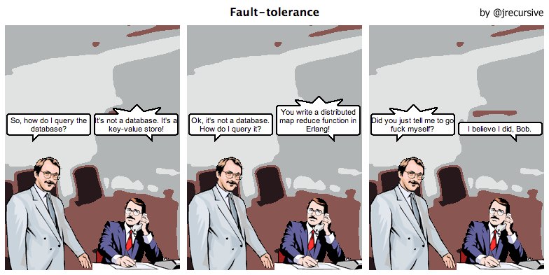

JSON is a beautiful format for storing objects as human readable text. It's
succeeded where XML has failed. Not only is it not shit, it's actually quite
good! But don't just take my word for it, have a look at some of the "cool"
ways you can generate and consume JSON.


### Syntax Highlighting for Vim

Useful when writing or editing JSON. [Grab it here](http://www.vim.org/scripts/script.php?script_id=1945) and drop into ~/.vim/plugin/


### Consuming with CURL

Disable curl's progress bar and enable compression

```bash
$ echo "silent=true" >> ~/.curlrc
$ echo "compressed=true" >> ~/.curlrc
```

Install a Node.js package that will help us prettify output

```bash
npm install -g jsontool
```

Now let's grab a record from Facebook

```bash
$ curl graph.facebook.com/stoptheclock | json
{
  "about": "Abolish the 28 Day Rule for Victorian Shelters\n\nhttp://stoptheclock.com.au\n\ninfo@stoptheclock.com.au",
  "category": "Community",
  "founded": "2010",
  "is_published": true,
  "mission": "To bring an end to the law requiring Victorian shelters to kill healthy adoptable cats and dogs after four weeks.",
  "talking_about_count": 2,
  "username": "Stoptheclock",
  "website": "http://stoptheclock.com.au",
  "were_here_count": 0,
  "id": "167163086642552",
  "name": "Stop The Clock",
  "link": "http://www.facebook.com/Stoptheclock",
  "likes": 5515
}
```


### Storing our JSON

The simplest solution is to save it to a file...

```bash
$ curl -s graph.facebook.com/stoptheclock | prettify_json.rb > fb_gfd.json
```

...but other applications can accept JSON such as [CouchDB](http://couchdb.apache.org/)

Here we'll create a new database, store our JSON to it and then retrieve it.

```bash
# Create a database on CouchDB
$ curl localhost:5984/_all_dbs-X PUT localhost:5984/facebook
{"ok":true}

# Check it's there
$ curl localhost:5984/_all_dbs
["facebook","test"]

# Save our document to it
$ curl -X PUT localhost:5984/facebook/stoptheclock -d @fb_stc.json
{"ok":true,"id":"stoptheclock","rev":"1-f0422f8044e911b2f97c6ad71136eda1"}

# Check it's there
$ curl localhost:5984/facebook/stoptheclock | json
{
  "about": "Abolish the 28 Day Rule for Victorian Shelters\n\nhttp://stoptheclock.com.au\n\ninfo@stoptheclock.com.au",
  "category": "Community",
  "_rev": "1-f0422f8044e911b2f97c6ad71136eda1",
  "_id": "stoptheclock",
  "founded": "2010",
  "is_published": true,
  "mission": "To bring an end to the law requiring Victorian shelters to kill healthy adoptable cats and dogs after four weeks.",
  "talking_about_count": 2,
  "username": "Stoptheclock",
  "website": "http://stoptheclock.com.au",
  "were_here_count": 0,
  "id": "167163086642552",
  "name": "Stop The Clock",
  "link": "http://www.facebook.com/Stoptheclock",
  "likes": 5515
}
```


### Querying CouchDB is outside the scope of this tutorial




Posts in this series:

* [JSON from the Command Line](2011/Feb/19/json-from-the-command-line)
* [JSON from Javascript](2011/Feb/19/json-from-javascript)
* [JSON with Ruby and Rails](2011/Feb/20/json-with-ruby-and-rails)
* [JSON in your Web Browser](2011/Feb/20/json-in-your-web-browser)
