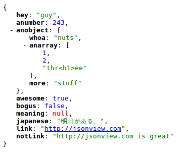

Web browsers don't tend to display JSON very nicely. See how yours does with
[this example](http://benhollis.net/software/jsonview/example.json). Some handy
plugins that help with this. While they currently only allow viewing, how long
before we se some PUT/POST action?

### [JSONView for Firefox](https://addons.mozilla.org/en-us/firefox/addon/jsonview/)

> Normally when encountering a JSON document (content type
> "application/json"), Firefox simply prompts you to download the file.  With
> the JSONView extension, JSON documents are shown in the browser  similar to
> how XML documents are shown. The document is formatted,  highlighted, and
> arrays and objects can be collapsed.  Even if the JSON  document contains
> errors, JSONView will still show the raw text.

There is also an [Unofficial JSONView port for Chrome](https://chrome.google.com/extensions/detail/chklaanhfefbnpoihckbnefhakgolnmc) and the [Unfortunately Named "XML View" for Safari](http://www.entropy.ch/software/MacOSX/xmlviewplugin/)

When installed, your JSON will look more like this:

*JSONView browser plugins prettify*

Posts in this series:

  * [JSON from the Command Line](/2011/02/json-from-the-command-line/)
  * [JSON from Javascript](/2011/02/json-from-javascript/)
  * [JSON with Ruby and Rails](/2011/02/json-with-ruby-and-rails/)
  * [JSON in your Web Browser](/2011/02/json-in-your-web-browser/)
