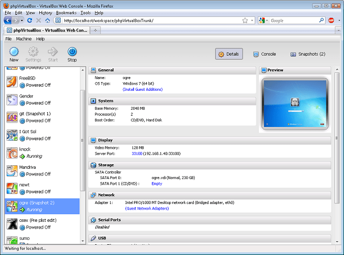

**Use Virtualization**

If I could offer you only one tip for the future, virtualization would be it.
The long-term benefits of virtualization have been proved by scientists,
whereas the rest of my advice has no basis more reliable than my own meandering
experience.

OK, so which server OS virtualization platform are we going to use in our home data center? We've got a few choices:

### [VMware vSphere Hypervisor](http://www.vmware.com/products/vsphere-hypervisor/overview.html)

VMware shows little regard for non Windows folk, requiring us to run the
vSphere Client under a virtual machine. running windows. VMware can fuck right
off.

### [Xen](http://xen.org/)

I love Xen and am pleased to see debian is again supporting it. Amazon use Xen
for their EC2 service and the last time I looked the majority of big virtual
hosting providers were using it. A couple of years back I wrote a web interface
for Xen called [Xenium](https://github.com/mbailey/xenium).

After all that gushing you're probably going to think I'm recommending you use Xen right? Nope!

### [Oracle VirtualBox](http://www.virtualbox.org/)

I think my love for Xen caused me to ignore this option until recently.

VirtualBox is cross platform open source (GPL2) virtualization software for
Linux, OSX, Windows and Solaris. It's easy to install and  someone has created
a web frontend ([phpvirtualbox](http://code.google.com/p/phpvirtualbox/)) for
it that looks just like the native GUI.

I've only just started exploring VirtualBox but for ease of installation,
freedom and functionality it looks like a winner for hosting @ home.

Things I like about VirtualBox

  * sound from Windows guest is playing on my Linux host
  * mouse moves smoothly with no need to use keys to release
  * easy to share a directory from host to guest (well...windows needed reboot)
  * VRDP gives you RDP even when your OS doesn't

