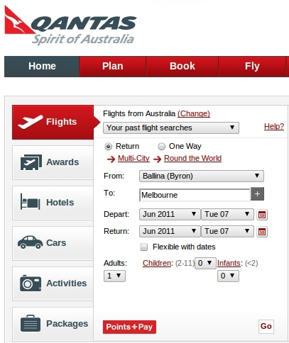
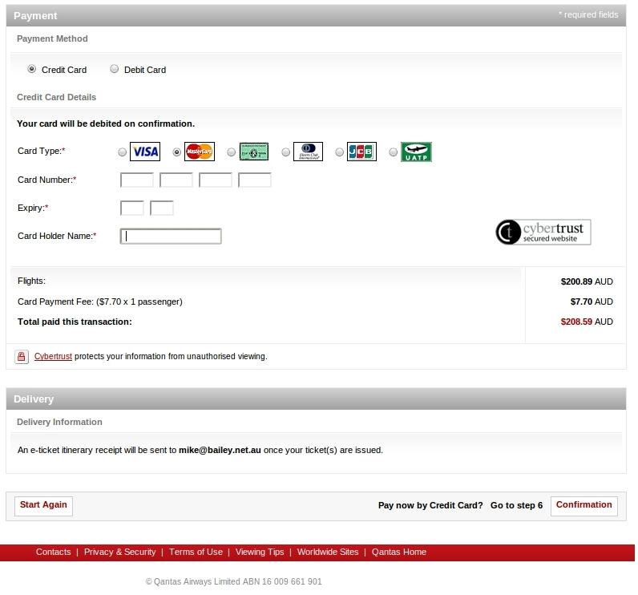

I'm glad Qantas don't design planes because frankly I don't think they would fly.

Web based flight bookings are _**money**_. They've changed the way we travel.
Why would Australia's national airline have such a _poorly designed user
interface_ for their booking website?

We don't always read what's on the buttons at the bottom of forms unless there
are two together. I'd love to see click rates of a the dummy buttons below.

### Harder to book

I'm guessing someone in marketing thought the best place to advertise their
'points and pay' offering was by linking to it from a submit button on the
search form. This button is larger and brighter than the button that submits
that takes you to your flight search results. It's simply a link that opens up
this page talking about their '[points and pay][1]' scheme. Fail.

*Which submit button should I press?*

Just to be clear, clicking the bottom on the left **does not submit the form**!

### Harder to pay

At the end of the booking process they provide a dangerous little button
sitting on it's own that discards your input. Fail. How many people in a hurry
click this when meaning to submit the form?

*How many people click 'Start Again' by mistake?*

[1]: http://www.qantas.com.au/travel/airlines/points-plus-pay/global/en
