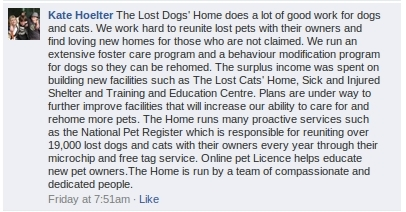
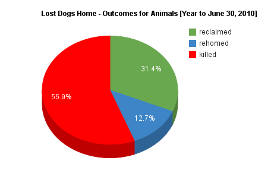
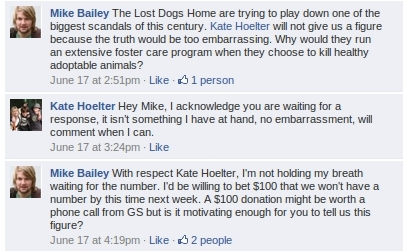

[Update] Kate Hoelter is not among the more than 550 people who have Like'd
this post on Facebook! We're still waiting for her to come back with a figure
for the number of animals they fostered out last year.

An animal pound contractor in Australia has discovered that selling themselves
as a loving protector of animals can bring millions in donations. The problem
is, their business model is based around adopting out a few of the unclaimed
animals and killing the rest.

Management at **The [Lost Dogs Home](http://lostdogshome.com)** must be fans of
the TV series [Mad Men](http://www.amctv.com/shows/mad-men), which featured
50's ad men trying to sell people on cigarettes in the wake of a _Reader's
Digest_ report that smoking will lead to various health issues including lung
cancer.

The following comment was made by _[Lost Dogs' Home](http://lostdogshome.com)_
fundraising staffer Kate Hoelter on the public Facebook Page of one of their
'Ambassadors', comedian Claire Hooper. I doubt Claire was ever told the
organisation using her face **killed 13,594 cats and dogs** while reporting a
**$2.7 mil profit** in 2010. Kate's comment was posted in response to me
pointing this fact out to Claire.

*LDH comment on Claire Hooper's FB Page*

## Let's Break It Down Shall We?

> The Lost Dogs' Home does a lot of good work for dogs and cats.

You kill most of them Kate.

*LDH killed 13,594 cats and dogs in 2009-2010*

> We work hard to reunite lost pets with their owners

You **refuse** to put photos of lost pets on the Internet to make it easier for
owners to find them.  **and find loving new homes for those who are not
claimed.** You killed 6 out of 10 unclaimed dogs last year without ever making
them available for adoption.

You close at lunchtime on Sundays even though weekends are the busiest time for adoption.

*LDH killed 6 out of 10 unclaimed dogs in 2009-2010*

> We run an extensive foster care program

I asked you how many animals were fostered in 2010 and you had no idea. I've
offered to donate $100 if you disclose the figure within the week. We're still
waiting.

*Mike Bailey bets $100 LDH won't reveal number of animals cared for by their 'extensive foster care program' in 2010..*

> and a behaviour modification program for dogs so they can be rehomed.

How many dogs that failed your temperament test passed after being placed in this program in 2010?

> The surplus income was spent on building new facilities

You ended the 2010 financial year with $9.3 mil cash and cash equivalents. In
that same year you killed 13,594 cats and dogs while adopting out just 3101
animals.

> such as The Lost Cats' Home,

This is a warehouse next door that doesn't even have an adoption section.

> Sick and Injured Shelter

Indoor kennels...

> and Training and Education Centre.

you mean to say you've been killing pets to save money to build a classroom?

> Plans are under way to further improve facilities that will increase our
> ability to care for and rehome more pets.

What is the point of improving facilities when you [close at lunchtime on
Sundays and public holidays](http://dogshome.com/opening-hours)? These are some
of the busiest days for adoption and pet stores are certainly open to take
advantage of it.

Questions are being asked about why you are [pursuing more pound
contracts][Pound Kill Rate Sparks Concern] when you already have such a high
kill rate.

> The Home runs many proactive services such as the National Pet Register which
> is responsible for reuniting over 19,000 lost dogs and cats with their owners
> every year through their microchip and free tag service.

[Central Animal Records](https://www.car.com.au/) also run a microchip
registry, as do [Australasian Animal Registry](http://www.aar.org.au/). How
does running an entirely separate business change that fact that you provide
high kill pound services to Councils?

**Online pet Licence helps educate new pet owners.**

Once again, this has nothing to do with your decision to kill so many of the animals entrusted to your care.

> The Home is run by a team of compassionate and dedicated people.

Motherhood statements like this mean nothing. Claiming to care does not equate to caring.

The [Lost Dogs Home](http://lostdogshome.com) has a business model built around killing. The current leadership have been in control for more than two decades and refuse to make meaningful changes.

**Statistics taken from _[The Lost Dogs Home Annual Report 2010](http://dogshome.com/98th-annual-report-2009-2010)_**

**_See also:_**

[Pound Kill Rate Sparks Concern](http://www.theage.com.au/victoria/pound-kill-rate-sparks-concern-20110430-1e29v.html), _The Sunday Age_ [May 1, 2011]

[Pound Kill Rate Sparks Concern]: http://www.theage.com.au/victoria/pound-kill-rate-sparks-concern-20110430-1e29v.html
