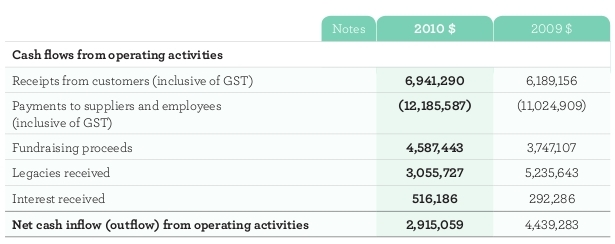

[Update] The ABC have acknowledged that the Lost Dogs Home [does actually get funding from government](http://www.abc.net.au/news/2011-07-29/dogs-home-welcomes-3m-bequest/2815668).

## Lost Dogs Home Receive Millions from Government

You're possibly already funding [The Lost Dogs Home](http://dogshome.com)
through your Council rates. As a provider of pound services to Victorian
Councils they receive government money to impound the majority of animals
coming into their "care". Of the animals not reclaimed by their owners in time
last year, most were killed (13,594 in total).

They are also contracted to provide Animal Control Officers to Councils. They
have the power to hand out fines and seize people's pets.

## Yet They Claim to Receive No Government Funding?

The _[Lost Dogs Home](2011-06-20-lost-dogs-home.md)_ repeated claims to receive no
government funding despite the fact that local government pays them to impound
the majority of the animals.

> The home, founded by a group of animal lovers in 1911, gets no government
> funding. However, Dr Smith revealed that in the past year - apart from Mr
> Samways's gift - it had received more than $6 million in bequests and
> donations.
>
> "$3m benefactor Frank Samways is a dog's - and the Lost Dogs Home's - best
> friend" - [The Age, 29 July
> 2011](http://www.theage.com.au/executive-style/3m-benefactor-frank-samways-is-a-dogs--and-the-lost-dogs-homes--best-friend-20110728-1i2dz.html)

Here Graeme Smith is reported to have made the claim personally,

> The Lost Dogs Home's Graeme Smith said the organisation did not receive any
> government funding, unlike the RSPCA. ''Tenders are judged on many factors.
> These include financial, ability to deliver, customer service, management,
> quality, etc,'' Mr Smith said.
>
> - "Pound kill rate sparks concern" [The Age 1 May, 2011](http://www.theage.com.au/victoria/pound-kill-rate-sparks-concern-20110430-1e29v.html#ixzz1TelKByW2)

This week Graeme Smith stood by and made no effort to correct a television
reporter who claimed his company "relies solely on the public's generosity to
get by financially". The ABC have since [issued a correction to the
story](http://www.abc.net.au/news/2011-07-29/dogs-home-welcomes-3m-bequest/2815668)
after a viewer complaint. Why does it take a concerned member of the public to
notify them when Graeme Smith was standing right beside the reporter?

<iframe src="https://player.vimeo.com/video/27105064" width="640" height="364" frameborder="0" webkitallowfullscreen mozallowfullscreen allowfullscreen></iframe>

<a href="https://vimeo.com/27105064">LDH get $3 mil donation</a> from <a href="https://vimeo.com/goodfordogs">Goodfordogs</a> on <a href="https://vimeo.com">Vimeo</a>.

## The Public are Being Misled

If you live in Melbourne there's a reasonable chance you're already paying The
Lost Dogs Home to impound cats and dogs through your Council rates. The
majority of animals not claimed by owners are being killed.

It appears the media are being told a very different story and are not checking
the facts. Members of the public deserve to know the truth about where their
money is going.

The same message applies to the [Cat Protection Society](http://catprotectionsociety.com) of Victoria.
