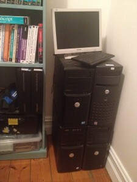
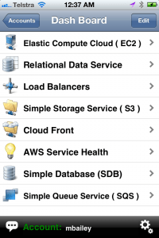
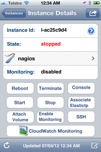
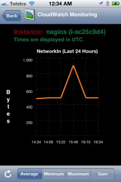
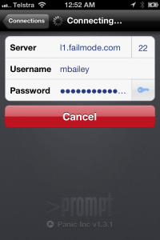

## The Urge to Own...

*Expensive Paperweights*

Something about my personality has seen me always running my own servers. In
the late 90s I setup a Pentium 100 with a permanent 28.8 kbps modem connection
to the Internet in a wardrobe at my parents house. It hosted my mail and web
services for a few years (including 18 months spent living in the U.K.).
Something about knowing the system down to the metal, and beyond that even, to
the environment has always been important to me. I think amongst systems people
I'm not alone.

## ... versus the Allure of The Cloud

Various factors have led me to abandon (at least for now) my desire to
[host@home](2011-04-11-hosthome-setting-up-your-network.md):

* power consumption (waste & cost) & heat output
* single points of failure (power, ADSL, theft)
* desire to eat my own dogfood

A few years back I found other services to be cheaper than Amazon's AWS
offerings. I'm currently exploring what has changed since then and how
individuals can use Amazon AWS to provide performant, highly available Internet
services at low cost.

## Mobile is Changing Everything

There are some great tools out there for controlling your Amazon services from
mobile devices. Cloud Services Manager is a great app for iOS that enables
control of AWS services on the go. My SSH client of choice for connecting from
iOS is [Prompt by Panic,
Inc](http://www.panic.com/blog/2011/04/introducing-prompt-ssh-for-ios/). These
two alone let give you a lot of control from your iPhone (or iPad).

*Cloud Services Manager for iPhone*

*Create, start, stop EC2 instances*

*Cloudwatch Stats*

*Prompt SSH client for iOS*

*Prompt is remarkably usable*

*ASCII steam locomotive (sl)*

 

## Cost Savings in Dev Land

When EC2 was first launched you lost everything if you shut an instance down.
These days Elastic Block Store (EBS) volumes are the default which means you
can stop and restart instances as you need them, paying only for the hours
they're running. This can make it more comfortable to tinker knowing you're
only paying while you're using it. Running 10 x m1.small instances will cost
$0.80 an hour which is quite affordable.

Note that you're charged by the month for the EBS volume the instance uses. The
charge includes a charge of approx. [$0.10 per GB-month of provisioned
storage and $0.10 per 1 million I/O
requests](http://aws.amazon.com/pricing/ebs/). I believe that creating a 10 GB
EBS volume and destroying it an hour later would be counted as 10 GB-months but
I want to confirm (or refute) this.

**To Be Continued...**

