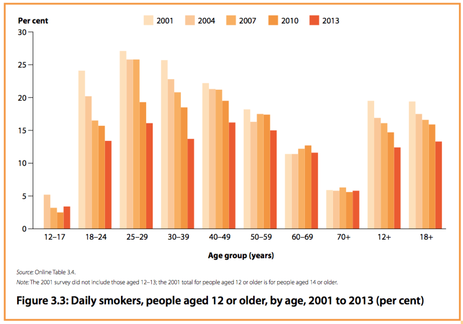

---

title: "Smoking: Prevention & Treatment"
date: 
  created: 2015-10-25
comments: true
categories:
-  smoking
---

When it comes to life threatening situations, prevention and treatment serve
different purposes and importantly, different populations.

For example, responses to the AIDS epidemic in the 1980s included campaigns to
educate the public on how to reduce their risk of contracting HIV as well as
research into a cure. Effective treatment options were discovered which greatly
improve the prognosis for infected people with access to them.

During this same period, our public health bodies seem to have focussed on prevent but
have failed to identify effective methods for people who want to stop smoking. The
[methods many organisations promote][methods] see reported relapse rates of around
80% within the first six months.

[methods]: http://www.quit.org.au/preparing-to-quit/choosing-best-way-to-quit

These include:

* Cold Turkey (Quitting abruptly)
* Nicotine Replacement Products (Patches, gum, lozenge, mouth spray, inhalator)
* Quitting Medication (Champix or Zyban)

It's unfathomable that ineffective treatments for tobacco addiction are being
promoted while little effort is made to identify effective methods for people
to use to stop smoking.

Australia's [National Tobacco Strategy][strategy] lists a number of objectives which
include:

* prevent uptake of smoking
* encourage and assist as many smokers as possible to quit as soon as possible, and prevent relapse

These objectives assist two separate populations, never smokers and smokers.
The needs of people who smoke cannot be served meaningfully while we do not
have effective methods for them to quit.

The reduction in smoking rates in Australia this century have been mainly due to an
increase in never-smokers with the percentage of ex-smokers staying faily constant.

**[National Drug Strategy Household Survey 2013][ndshs] - Tobacco Smoking Status**

> one-quarter (24%) of the population were ex-smokers and this has remained
> fairly stable since 1998 when the proportion of ex-smokers first exceeded the
> proportion smoking daily

{:class="img-responsive"}

Australia's smoking bans, tax hikes, advertising campaigns and other efforts may have
contributed to reduced uptake of smoking but do not appear to have made quitting easier.
While focussing on the children, there have been little change in daily smoking seen
among people aged 60 or older this century.

 

We know that most smokers [regret taking up the habit][regret]. We need to acknowledge
the high relapse rates for currently promoted smoking cessation methods and
get to work identifying effective alternatives.

In 2013, around 40% of Australians who smoke heavily tried to give up
unsuccessfully ([NDSHS][ndshs]). We don't need to be convinced we should quit, we
need to know how.

[strategy]: http://www.nationaldrugstrategy.gov.au/internet/drugstrategy/publishing.nsf/Content/national_ts_2012_2018
[regret]: http://www.ncbi.nlm.nih.gov/pubmed/15799597
[ndshs]: http://www.aihw.gov.au/alcohol-and-other-drugs/ndshs-2013/
