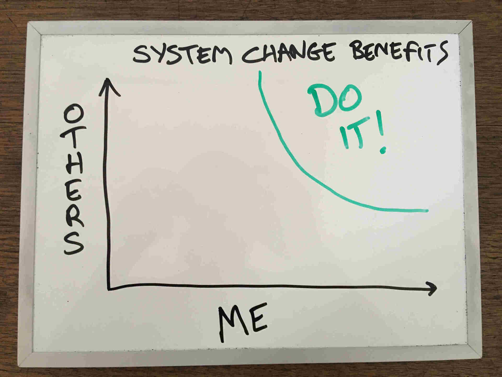

I don't consider myself a Buddhist but attest to their belief that "Life is
Suffering".  Not all of it all the time, but there's always some waiting. To
some this might sound like a pretty negative view but it doesn't have to be.
What gives me strength is the knowledge that not *all* suffering is out of my
control.

This post is about making changes to systems that affect other people. It's not
intended to cover changes to personal habits.

# Find Things Worth Suffering For

Life is change and change often involves suffering.

Bringing a pet into your life generally means accepting the grief the comes
with outliving them (unless you choose a [White Cockatoo][cocky] which can live
40-60 years in captivity).

Improving you health, wealth or education might involve going without things
you enjoy and doing things you don't.

System change that affects other people, whether in the workplace, government or
community is hard work and success is never guaranteed. If you're going to attempt
it, make sure you choose something worth suffering for.

# Serenity, Courage, Wisdom

Before the Internet came along, memes thrived in the form of kitchen calendars
and fridge magnets. You may be familiar with this one:



> God, grant me the serenity to accept the things I cannot change,  
> Courage to change the things I can,  
> And wisdom to know the difference.

- [Reinhold Niebuh](https://en.wikipedia.org/wiki/Serenity_Prayer)

Now I know Christian Theologians may not be in vogue these days but they *were*
"[putting a bird on it][put-a-bird-on-it]" long before the hipsters caught onto it. The value is
in the message, not who said it.

## "Accept the Things I Cannot Change"

I would change this to "Accept the things I *should* not change":

- A sysadmin with root privileges *can* invade people's privacy
- A person in executive government *can* enact laws that cause unnecessary suffering

Just because you *can* change the world to better suit you, it doesn't follow that you *should*.

I accept that I cannot change all the fridge magnets. It's reckon I *could*
get Alcoholics Anonymous to change the version they promote but *shouldn't* because
the change:

- would provide little benefit to me
- would provide little benefit to others
- would require a huge amount of effort (including other people's)

# Do you have 'skin in the game'?

Just because something *should* change, that doesn't neccessarily mean you should
be the one to do it. You know best how to scratch your own itch. Avoid trying
to lead on change that doesn't impact on your personally. You're unlikely to
have the passion, connection and understanding of someone with skin in the
game. By all means, support these efforts where you believe in the goals but
don't try to own them.

> A Pig and a Chicken are walking down the road.  
> The Chicken says: "Hey Pig, I was thinking we should open a restaurant!"  
> Pig replies: "Hm, maybe, what would we call it?"  
> The Chicken responds: "How about 'ham-n-eggs'?"  
> The Pig thinks for a moment and says: "No thanks. I'd be committed, but you'd only be involved."  

- [Pig and Chicken fable](https://en.wikipedia.org/wiki/Reinhold_Niebuhr)

It's captured more succintly in the "[Nothing About Us Without
Us][nothing-about-us]" mantra popular with ethnic, disability and other
marginalise groups.

# Does anyone else know/care?

Who else would benefit from the change? Who would suffer? If there isn't the
likelihood of a net benefit to the group, you're unlikely to get the buy-in
required to make the change. Unless you intend to mislead or coerce people
into doing things your way, you're probably best accepting this as a thing
you shouldn't change.

## "Courage to Change the Things I Can"

I don't think most people realise how malleable the world is. The video below
says it better than I can.

<iframe width="560" height="315" src="https://www.youtube.com/embed/zklbZR9025Y" frameborder="0" allow="accelerometer; autoplay; encrypted-media; gyroscope; picture-in-picture" allowfullscreen></iframe>

> “When you grow up you tend to get told that the world is the way it is and
> your life is just to live your life inside the world. Try not to bash into
> the walls too much. Try to have a nice family life, have fun, save a little
> money. That's a very limited life. Life can be much broader once you discover
> one simple fact: Everything around you that you call life was made up by
> people that were no smarter than you. And you can change it, you can
> influence it… Once you learn that, you'll never be the same again.”

- Steve Jobs

## "And the Wisdom to Know the Difference"

I'm not sure about wisdom but I hope this post offers some food for thought.

[put-a-bird-on-it]: https://www.youtube.com/watch?v=iHmLljk2t8M
[cocky]: https://en.wikipedia.org/wiki/White_cockatoo
[nothing-about-us]: https://en.wikipedia.org/wiki/Nothing_About_Us_Without_Us
