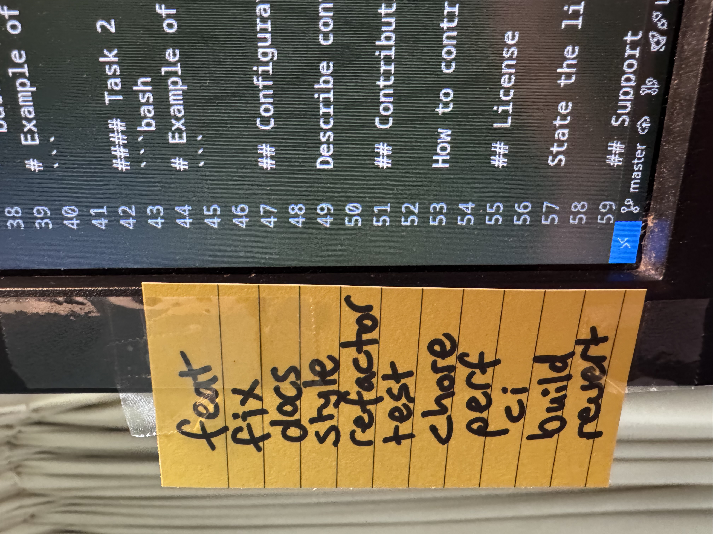

# Conventional Commits

A specification for adding human and machine readable meaning to commit messages. [Learn more](https://www.conventionalcommits.org/)

| Prefix   | Description                                          |
| -------- | ---------------------------------------------------- |
| feat     | New features or significant changes to functionality |
| fix      | Bug fixes                                            |
| docs     | Documentation changes only                           |
| style    | Code style/formatting changes (no code change)       |
| refactor | Code changes that neither fix bugs nor add features  |
| test     | Adding or modifying tests                            |
| chore    | Maintenance tasks, dependency updates, etc.          |
| perf     | Performance improvements                             |
| ci       | Changes to CI/CD configuration and scripts           |
| build    | Changes to build system or external dependencies     |
| revert   | Reverting a previous commit                          |
## Tips for learning

### 1. Stick them to your monitor




### 2. If you're unsure, ask an LLM

Get [README](../software/cli/aider/README.md) to commit all pending changes with a suitable commit message, then exit.

```
$ aider --commit
───────────────────────────────────────────────────────────────────────────────────────
Aider v0.65.2.dev73+gcab8bf5f
Main model: claude-3-5-sonnet-20241022 with diff edit format, infinite output
Weak model: claude-3-5-haiku-20241022
Git repo: .git with 7 files
Repo-map: using 1024 tokens, auto refresh
Commit b24eee5 docs: Rename README-template.md to README.md
```