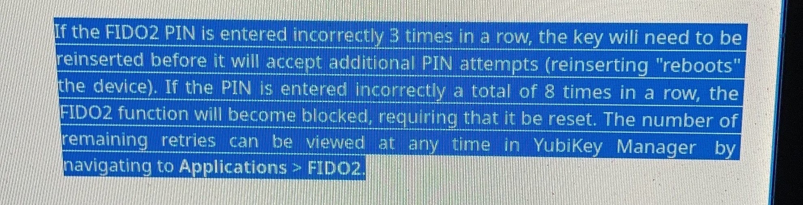

# yubikey


- Reset Yubikey
- [yubikey-slot-disable](yubikey-slot-disable.md) (yubisneeze)

- [ykman-yubikey-manager](ykman-yubikey-manager.md)
- [PassKeys](https://www.nitrokey.com/blog/2022/fido2-webauthn-passkeys-2022-and-2023)
- [Signing git commits with SSH Keys](https://calebhearth.com/sign-git-with-ssh)
- [managing-multiple-yubikeys](managing-multiple-yubikeys.md)
- [setting-openpgp-touch-slot-policies](setting-openpgp-touch-slot-policies.md)
- [ssh](ssh.md)
  - [Resident FIDO2 SSH Keys](https://developers.yubico.com/SSH/Securing_SSH_with_FIDO2.html)


 

## Install (fedora)

- [YubiKey Manager  Yubico (www.yubico.com)](https://www.yubico.com/support/download/yubikey-manager/)

```
$ sudo dnf -y install         \
  yubikey-manager             \
  yubikey-personalization-gui \
  python3-yubikey-manager

#   fedora-packager-yubikey     \
#   pcsc-tools                  \
#   ykclient                    \
#   ykpers                      \
#   yubico-piv-tool             \
#   yubico-piv-tool             \
```

## Yubikey Manager

List keys:
```
$ sudo ykman list
YubiKey 5C Nano (5.4.3) [OTP+FIDO+CCID] Serial: 16381159
YubiKey 5 NFC (5.2.4) [OTP+FIDO+CCID] Serial: 12001438
```

### FIDO2 PINs

- [Understanding YubiKey PINs – Yubico (support.yubico.com)](https://support.yubico.com/hc/en-us/articles/4402836718866-Understanding-YubiKey-PINs)

### `ykman fido info`
```
[m@x2 ~]$ ykman fido info
PIN is set, with 8 attempt(s) remaining.
```
- `ykman fido access change-pin`
- `ykman fido reset`

#### Reset PIN

```
$ ykman fido reset
WARNING! This will delete all FIDO credentials, including FIDO U2F credentials, and restore factory settings. Proceed? [y/N]: y
Remove and re-insert your YubiKey to perform the reset...
Touch your YubiKey...
```


## [Yubikey and SSH via PAM](https://developers.yubico.com/yubico-pam/YubiKey_and_SSH_via_PAM.html)

- /etc/ssh/authorized_yubikeys # we're using this file (ansible)
- .yubico/authorized_yubikeys


```
yubico-piv-tool -a change-pin
```

## [PIV setup](https://developers.yubico.com/PIV/Guides/PIV_Walk-Through.html)

## [Using SSH User Certificates with PIV keys](https://developers.yubico.com/PIV/Guides/SSH_user_certificates.html)


cp /usr/lib64/libykcs11.so /usr/local/lib/
cp /usr/lib64/libpkcs11.so /usr/local/lib/

ssh-add -D
ssh-add -e /usr/local/lib/libykcs11.so

*FAIL*
```
$ ssh-add -s /usr/local/lib/libykcs11.so
Enter passphrase for PKCS#11: 
^C
```


  man ssh-agent
     -P provider_whitelist
             Specify a pattern-list of acceptable paths for PKCS#11 and FIDO authenticator shared libraries that may be used
             with the -S or -s options to ssh-add(1).  Libraries that do not match the whitelist will be refused.  See PATTERNS
             in ssh_config(5) for a description of pattern-list syntax.  The default whitelist is “/usr/lib/*,/usr/local/lib/*”.


## Configure System

```
$ sudo systemctl start pcscd
$ sudo systemctl enable pcscd
```


## Configure Yubikey


**Disable the default text when touched**
```
$ ykpersonalize -1 -z
Firmware version 5.2.4 Touch level 773 Program sequence 1

Configuration in slot 1 will be deleted

Commit? (y/n) [n]: y

```

