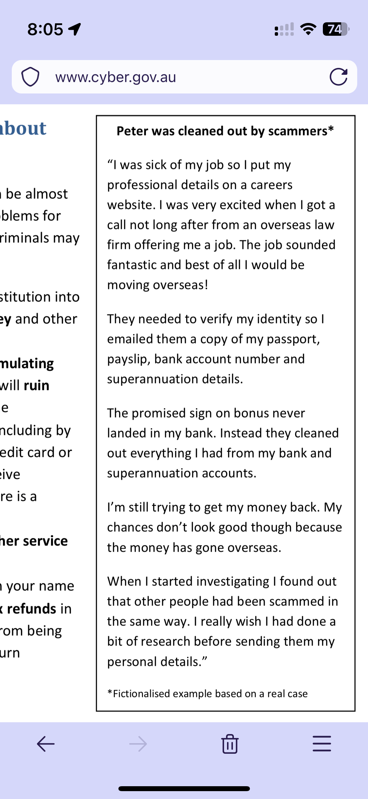

# Identity Theft

- [Rising number of Australians hit by frauds and scams - KPMG Australia (home.kpmg)](https://home.kpmg/au/en/home/media/press-releases/2022/03/rising-number-australians-hit-by-frauds-and-scams-24-march-2022.html)
- [1 in 9 Australians experienced personal fraud in 2020-21  Australian Bureau of Statistics (www.abs.gov.au)](https://www.abs.gov.au/media-centre/media-releases/1-9-australians-experienced-personal-fraud-2020-21)
- [Personal Fraud, 2020-21 financial year  Australian Bureau of Statistics (www.abs.gov.au)](https://www.abs.gov.au/statistics/people/crime-and-justice/personal-fraud/latest-release)
- [Dark web markets are hungry for Australian identity data  CSO Online (www.csoonline.com)](https://www.csoonline.com/article/3664117/dark-web-markets-are-hungry-for-australian-identity-data.html)
- [Philippines call centre worker stole Australian Citibank customer details for Sydney crime gang, police say (www.smh.com.au)](https://www.smh.com.au/national/nsw/philippines-call-centre-worker-stole-australian-citibank-customer-details-for-sydney-crime-gang-police-say-20150702-gi3lbd.html)
- [Massive Philippines data breach now searchable online  WIRED UK (www.wired.co.uk)](https://www.wired.co.uk/article/philippines-data-breach-comelec-searchable-website)

## Identity theft can be devastating for the victim

>The consequences of identity crime for individuals can be serious, including **financial loss, reputational damage as well as emotional and psychological harm**.
>
> - [Identity crime and misuse in Australia : Key findings from the National Identity Crime and Misuse Measurement Framework Pilot](https://www.homeaffairs.gov.au/criminal-justice/files/national-identity-crime-and-misuse-pilot.PDF)

## 154,000 Australians experienced Identity theft in 2020-21

- [1 in 9 Australians experienced personal fraud in 2020-21  Australian Bureau of Statistics (www.abs.gov.au)](https://www.abs.gov.au/media-centre/media-releases/1-9-australians-experienced-personal-fraud-2020-21)
- 154,000 Australians (0.8%) experienced identity theft (the rest were card fraud and scams).

> Identity theft is the use of someone’s personal details in stolen, fraudulent, or forged documents without permission, or otherwise illegally appropriating another’s identity.
> 
> An estimated 0.8% of Australians aged 15 years and over (154,300) experienced identity theft in 2020-21. This was similar to the rate in 2014-15 (0.7%).
> 
> In the five years prior to the survey, an estimated 2.8% of persons (570,900) experienced identity theft. The majority (93% or 529,600) reported their most recent incident to an authority, most commonly a bank or financial institution (71%).
> 
> Of those who experienced identity theft, the stolen personal information was most commonly used to obtain money from a bank account, superannuation, or investments or shares (57% or 324,800).

## Dark web markets are hungry for Australian identity data

- Identity now has a very tangible value as there is are secondary markets that is able to monetise stolen identities
- Identity is now a commodity (has exchange value that aligns with use value).

>Australians’ confidential financial, personal, and identity data is being channelled in large volumes through dark web marketplaces and is the second-most-expensive in the world, according to a new analysis that bodes poorly for the thousands of victims compromised in the recent hack of a key National Disability Insurance Scheme (NDIS) software provider.
>
  ==Full identity sets relating to Australians are selling for $112.50 on the dark web market==, which NordVPN security experts, who conducted the ==analysis in early April 2022==, said has previously sold more than 720,000 pieces of data for $23.2 million.
 >
>- [Dark web markets are hungry for Australian identity data  CSO Online (www.csoonline.com)](https://www.csoonline.com/article/3664117/dark-web-markets-are-hungry-for-australian-identity-data.html)

> "they will be able to create accounts in your name — for example, on cryptocurrency exchanges — with a view to using them to launder money. As a result, you may run into problems with the law."
> - [A selfie with you holding your ID is worth more than just your ID (kaspersky.com.au)](https://www.kaspersky.com.au/blog/selfie-with-id-card-scam/23215/)

## Background check companies are high value targets

> Four parallel data breach lawsuits have been filed against a 45-year-old background check services company based in Massachusetts.
>
> [Creative Services, Inc](http://www.creativeservices.com/). (CSI), located in Mansfield, provides background screening, drug testing and security consulting services to employers, institutions and governments in the United States and overseas.
> 
> By the end of January 2022, an investigation into the activity had revealed that personal identifying information (PII) belonging to CSI’s clients had been compromised in the security incident. Data impacted by the incident included names, dates of birth, financial account numbers, Social Security numbers and driver’s license numbers
>
>- [Background Check Company Sued Over Data Breach - Infosecurity Magazine (www.infosecurity-magazine.com)](https://www.infosecurity-magazine.com/news/background-check-company-sued-over/)

## Overseas call centre employee allegedly sold Australian Citibank customers personal information to Sydney crime syndicate

> An overseas call centre employee allegedly collected banking details of Australian Citibank customers and sold them to a Sydney crime syndicate, which then used the details to defraud the customers of more than $1 million, police say.
>
> Police allege the worker, employed by a firm in the Philippines that carries out customer relations for a number of Australian-based companies, collected banking information, passwords and personal details for the syndicate.
> 
>The syndicate then allegedly used the details to make withdrawals and order new credit cards.
> 
 - [Philippines call centre worker stole Australian Citibank customer details for Sydney crime gang, police say (www.smh.com.au)](https://www.smh.com.au/national/nsw/philippines-call-centre-worker-stole-australian-citibank-customer-details-for-sydney-crime-gang-police-say-20150702-gi3lbd.html)

## Privacy Act amended in response to Optus and Medibank breaches

>The Office of the Australian Information Commissioner (OAIC) welcomes the passing of the Privacy Legislation Amendment (Enforcement and Other Measures) Bill 2022, which enhances the OAIC’s ability to regulate in line with community expectations and protect Australians’ privacy in the digital environment.
> 
  The Bill introduces significantly increased penalties for serious and or repeated privacy breaches and greater powers for the OAIC to resolve breaches.
  >
>- [OAIC welcomes passing of Privacy Bill - Home (www.oaic.gov.au)](https://www.oaic.gov.au/updates/news-and-media/oaic-welcomes-passing-of-privacy-bill)

## Example from cyber.gov.au

https://www.cyber.gov.au/sites/default/files/2020-05/Protecting%20your%20identity%20-%20What%20everyone%20needs%20to%20know.pdf

