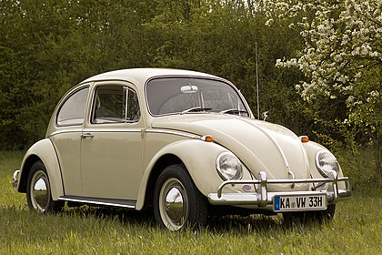
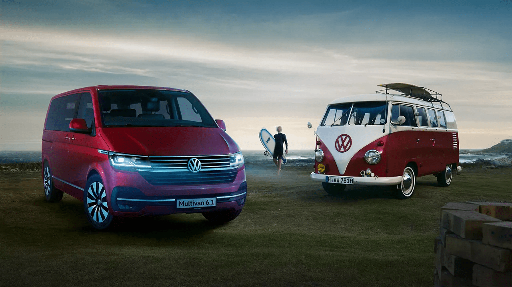
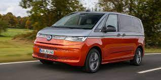

# Volkswagen

Volkswagen was ==established in 1937== by the German Labour Front (Deutsche Arbeitsfront) in Berlin. In the early 1930s, ==cars were a luxury== – most Germans could afford nothing more elaborate than a motorcycle and ==only one German out of 50 owned a car==. Seeking a potential new market, some car makers began independent "people's car" projects – the Mercedes 170H, BMW 3/15, Adler AutoBahn, Steyr 55, and Hanomag 1.3L, among others.

## Volkswagen Type 1 (*a.k.a. Volkswagen Beetle, Bug*)

Production: 1938 - 2003
Lead Engineer: [Ferdinand Porsche](https://en.wikipedia.org/wiki/Ferdinand_Porsche)

## Volkswagen Type 2 (*a.k.a. Combi, Transporter, Multivan*)

Production: 1949 - present

> The Volkswagen Type 2, known officially (depending on body type) as the Transporter, Kombi or Microbus, or, informally, as the Bus (US), Camper (UK) or Bulli (Germany), is a forward control light commercial vehicle introduced in 1950 by the German automaker Volkswagen as its second car model. Following – and initially deriving from – Volkswagen's first model, the Type 1 (Beetle), it was given the factory designation Type 2.
> [Volkswagen Type 2 - Wikipedia](https://en.wikipedia.org/wiki/Volkswagen_Type_2)

The Volkswagen Transporter / Multivan has been built on revisions Volkswagen Group's ==T platform== for over 70 years.

The 2022 Multivan switched to the ==MQB Platform== that underpins many of VW’s current passenger cars, including the Golf hatchback, Passat sedan and Tiguan SUV.

## Volkswagen Group platforms

- [List of Volkswagen Group platforms - Wikipedia](https://en.wikipedia.org/wiki/List_of_Volkswagen_Group_platforms)

The German automotive concern, Volkswagen Group has, since the 1970s, developed a series of shared automobile platforms for their motor vehicles.

### Volkswagen Group MQB platform

The **Volkswagen Group MQB platform** is the company's strategy for shared [modular design](https://en.wikipedia.org/wiki/Modular_design "Modular design") construction of its [transverse](https://en.wikipedia.org/wiki/Transverse_engine "Transverse engine"), [front-engine, front-wheel-drive layout](https://en.wikipedia.org/wiki/Front-engine,_front-wheel-drive_layout "Front-engine, front-wheel-drive layout") (optional [front-engine, four-wheel-drive layout](https://en.wikipedia.org/wiki/Front-engine,_four-wheel-drive_layout "Front-engine, four-wheel-drive layout")) automobiles. It was first introduced in the [Volkswagen Golf Mk7](https://en.wikipedia.org/wiki/Volkswagen_Golf_Mk7 "Volkswagen Golf Mk7") in late 2012. Volkswagen spent roughly $8bn developing this new platform and the cars employing it. The platform underpins a wide range of cars from the supermini class to the mid size SUV class.

VW Golf

VW Passat

VW Tiguan

VW Multivan T7
