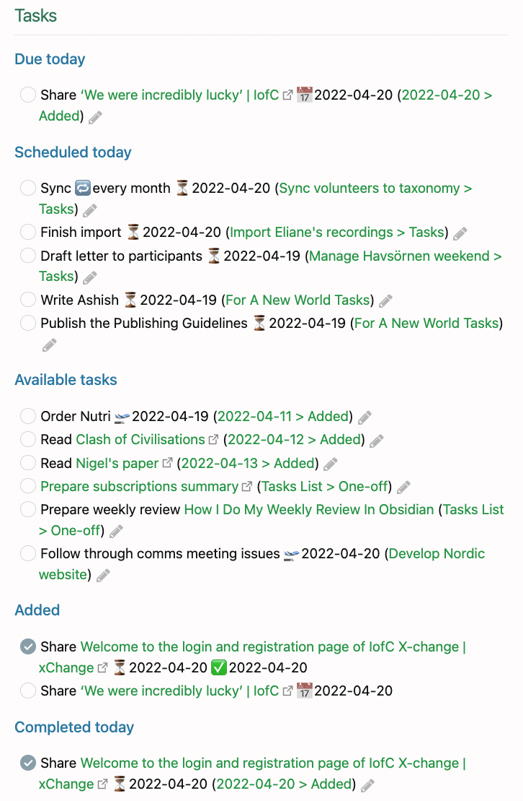

# obsidian tasks plugin

- [Quick Reference (obsidian-tasks-group.github.io)](https://obsidian-tasks-group.github.io/obsidian-tasks/quick-reference/)
- [Introduction (obsidian-tasks-group.github.io)](https://obsidian-tasks-group.github.io/obsidian-tasks/)
- (not) [My Task Management System (forum.obsidian.md)](https://forum.obsidian.md/t/my-task-management-system/36198)

## Hotkeys

- CTRL-SHIFT-T: Create or edit task
- CTRL-L: Toggle Task/Checkbox Done

## Example Queries in Daily Note Tasks

>-   Any task that requires more than one action to complete is a project. Each project is a note in my Obsidian vault, and the tasks related to that project sit in that note.
>-   Recurring tasks also each have their own note. This enables me to list all my recurring tasks via Dataview, and has the further advantage that I can see the history of when I completed each recurring task.
>-   A one-off task can go into any note to which it relates, but most often that is a project note or my Daily Note.
>-   Every task is either ‘planned’ or ‘unplanned’. If it is unplanned, it does not use the Tasks plugin functionality at all, and is just a checkbox. I can review all my unplanned tasks using a Dataview query and see which need to be planned. Planned tasks use the power of the Tasks plugin to determine when they start (are available from), are scheduled, or are due.
>-   My Daily Note uses Tasks queries to show which tasks are due, scheduled or available today - as well as those completed today.
>
> - [My Task Management System (forum.obsidian.md)](https://forum.obsidian.md/t/my-task-management-system/36198)

