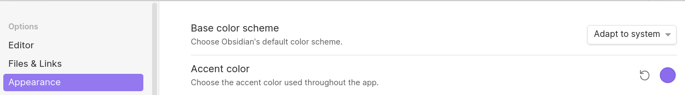
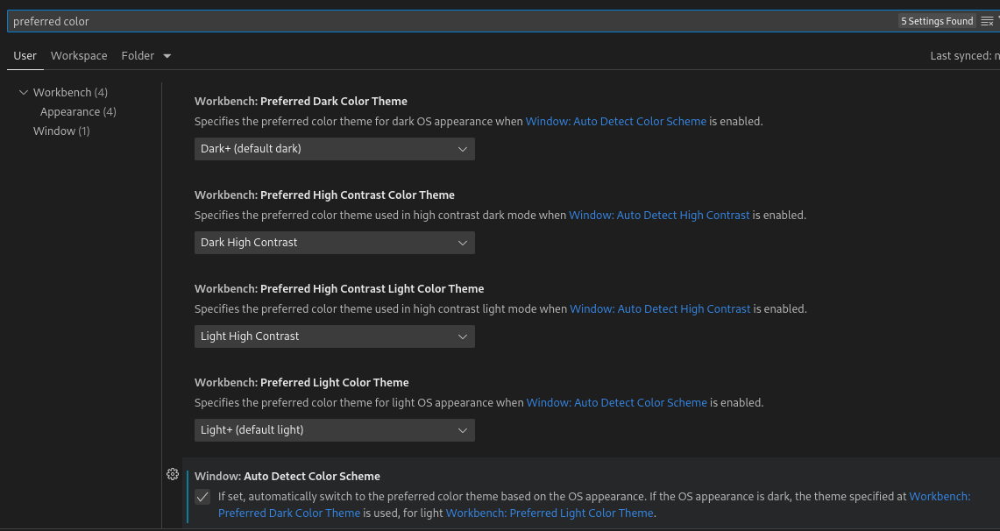
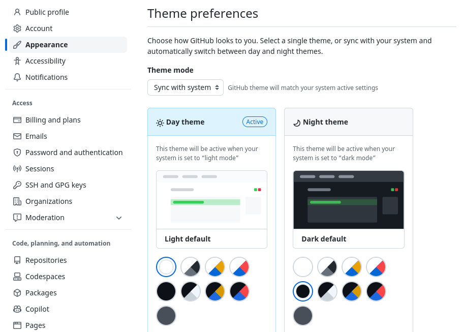
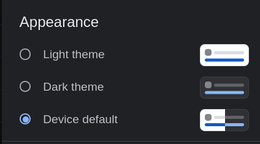

# Adapt to System Appearance (App Dark Mode)

| Application    | Supported           | Restart Required | Comments                      |
| -------------- | ------------------- | ---------------- | ------------------------------|
| Obsidian       | Yes                 | Yes              |                               |
| Gnome Terminal | ?                   |                  |                               |
| VSCode         | Broken on fedora-36 | -                | Seems to be broken on Fedora  |
| github.com     | Yes                 | No               | See Below                     |
| Google Search  | Yes                 | No               | See Below                     |        |

## Obsidian

Currently requires a restart when system setting changed.

 

## VSCode

No support on linux.

> Windows and macOS support light and dark color schemes. 
>
>- [Visual Studio Code Themes (code.visualstudio.com)](https://code.visualstudio.com/docs/getstarted/themes)

- Window: Auto Detect Color Scheme
- Workbench: Preferred Dark Color Theme
- Workbench: Preferred Light Color Theme

## GitHub.com

- https://github.com/settings/appearance

Allows you to select "Sync with system" and select light and dark themes.

## Google Search

Configure in Settings when logged in at https://www.google.com/search

