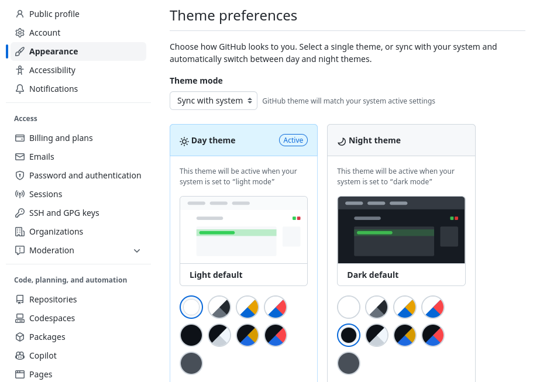
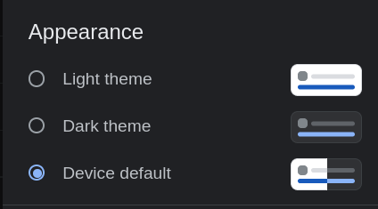

# Appearance (Light / Dark Mode)

Increase eye comfort by using "Dark Mode" in dark environments.

## Operating Systems

### Linux

- **Gnome 40:** 
    - **Check theme:** `gsettings get org.gnome.desktop.interface gtk-theme`

### macOS

- TBA
### Windows

Windows 10 does not come with an option to update base on time of day.

- **[Windows-Auto-Night-Mode (github.com)](https://github.com/AutoDarkMode/Windows-Auto-Night-Mode):**  Automatically switches between the dark and light theme of Windows 10 and Windows 11
- **Appearance Toggle Script:** personal/appearance/bin/appearance-toggle.ps1

## Applications

- **[Obsidian](obsidian/README.md):** Settings → Appearance → Base color scheme → Adapt to system (restart required)
- **[VS Code](vscode/README.md):** Add _"window.autoDetectColorScheme": true_ in settings.json
- **Webbrowsers:** See below for details
- GitHub.com: See below
- **Google Search:** see below
- **Windows Terminal:** Set [`colorscheme`](https://learn.microsoft.com/en-us/windows/terminal/customize-settings/profile-appearance#color-scheme)

**See also:**
- [Apps with Auto Dark Mode support · AutoDarkModeWindows-Auto-Night-Mode Wiki (github.com)](https://github.com/AutoDarkMode/Windows-Auto-Night-Mode/wiki/Apps-with-Auto-Dark-Mode-support)

### Web browsers

Follow system appearance in your web browser with Dark Reader plugin for Firefox, Chrome or Edge.

- [Dark Mode for Webbrowser · AutoDarkModeWindows-Auto-Night-Mode Wiki · GitHub (github.com)](https://github.com/AutoDarkMode/Windows-Auto-Night-Mode/wiki/Dark-Mode-for-Webbrowser)

1. Install Dark Reader plugin for your browser:

    - [Dark Reader for Firefox](https://addons.mozilla.org/en-US/firefox/addon/darkreader/)  
    - [Dark Reader for Google Chrome](https://chrome.google.com/webstore/detail/dark-reader/eimadpbcbfnmbkopoojfekhnkhdbieeh)  
    - [Dark Reader for Microsoft Edge](https://microsoftedge.microsoft.com/addons/detail/dark-reader/ifoakfbpdcdoeenechcleahebpibofpc)

2. Configure Dark Reader plugin to "Use system colour scheme".

## Services

Many web applications support Dark Mode and some can even respect your operating system's Appearance setting.

## GitHub.com

- https://github.com/settings/appearance

Allows you to select "Sync with system" and select light and dark themes.

## Google Search

Configure in Settings when logged in at https://www.google.com/search

