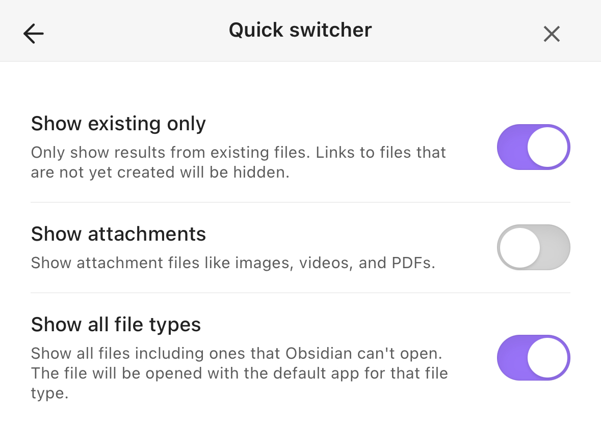

# Obsidian Settings that may break Quick Switcher and Link Completer

Quick Switcher breaks for me when either of the following settings are enabled.

The result is that I need to include hyphens when searching. 

### Desktop App

Enabling "Show attachments" or "Show all file types" degrades switcher for me.

**Settings -> Core Plugins -> Quick switcher**


This can also be updated in the config file:

**`.obsidian/switcher.json`**
```json
{
  "showAttachments": false,
  "showAllFileTypes": false
 }
 ```


### Mobile App

**Settings -> Quick Switcher -> Show Attachments**


