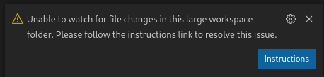

# VS Code - Visual Studio Code

[Visual Studio Code - Code Editing. Redefined (code.visualstudio.com)](https://code.visualstudio.com/)

## Pages

- [Co-pilot alternatives](Co-pilot%20alternatives.md)
- [Extensions](extensions.md)
- [Keyboard Shortcuts](Keyboard%20Shortcuts.md)
- [Markdown](markdown.md)
- [Settings](./settings.md)
- [git](git.md)

## Usage


## Handy commands

**Open something in a new window:** `code -n foobar`
**Add folder to workspace**: `code --add .`
**Diff from last save**: Ctrl-K-D
## Install

- [Install VS Code Application](Install%20VS%20Code%20Application.md)
- [Install VS Code CLI](Install%20VS%20Code%20CLI.md): Open paths from the command line with `code` command.

## Configure

File locations:

- `~/.config/Code/User`
- `~/.config/Code/Workspaces`
- `~/.vscode`
    - `argv.json` : pass permanent command line arguments to VS Code.
    - `extensions`: your extensions live here

View the default values in the Settings editor or see a read-only version of the [`defaultSettings.json`][defaults] via **Preferences: Open Default Settings (JSON)**

My preferred settings:

| Setting  ID              | Value | Comment                                          |
| ------------------------ | ----- | ------------------------------------------------ |
| git.rebaseWhenSync       | true  | Always use rebase instead of merge when running. |
| files.insertFinalNewline | true  | Insert final newline into file when saving       |

[defaults]: https://code.visualstudio.com/docs/getstarted/settings#_default-settings

### Terminal settings

### Keyboard Shortcuts - Default

**CTRL-m**: View: Toggle Maximised Panel


### Annoyance: Tab Key Moves Focus

[This breaks shell completion in terminal if it's enabled](https://stackoverflow.com/questions/77167764/why-is-vs-code-using-the-tab-key-to-move-focus-from-the-integrated-terminal-inst)


#### Terminal › Integrated: Allow Chords

- Make things like `CTRL-L`` work.

Whether or not to allow chord keybindings in the terminal. Note that when this is true and the keystroke results in a chord it will bypass [Terminal › Integrated: Commands To Skip Shell](vscode-file://vscode-app/usr/share/code/resources/app/out/vs/code/electron-sandbox/workbench/workbench.html "terminal.integrated.commandsToSkipShell"), setting this to false is particularly useful when you want ctrl+k to go to your shell (not VS Code).

### shebang

```
"shellcheck.arguments": [
    "--format=gcc",
    "--severity=warning",
    "--shell=bash",
    "--external-sources",
    "--enable=all",
    "--shebang=#!/usr/bin/env bash"
],
```


## Shortcuts

```yaml
Ctrl-p-p: Go back to previous file
CTRL+ALT+-: Go back
```


## GUI

Open two terminals with horizontal split:

- Open a first terminal
- Open a second one
- Right click a terminal and select "move to editor area"

## Troubleshooting


## .gitignore from different folders respected

- [Annoyance - Features (including quickopen, git) exclude files based on .gitignore (even if in different folder!)](https://github.com/microsoft/vscode/issues/15604)

### File watchers

- [Visual Studio Code is unable to watch for file changes in this large workspace" (error ENOSPC)](https://code.visualstudio.com/docs/setup/linux#_visual-studio-code-is-unable-to-watch-for-file-changes-in-this-large-workspace-error-enospc)



Check your watcher limits, current usage and how to increase the limits for [inotify](../../cli/inotify.md)

```json

Maybe exclude some from vscode watchers:
```json
"files.watcherExclude": {
    "**/.git/objects/**": true,
    "**/.git/subtree-cache/**": true,
    "**/node_modules/*/**": true
  }
```


## See also

- [Set up a Mac in 2024 for Power Users and Developers - YouTube (www.youtube.com)](https://www.youtube.com/watch?v=GK7zLYAXdDs&t=114s)