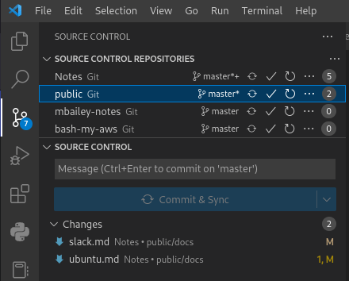

# Git in vscode

## Settings


```shell
"scm.providerCountBadge": "visible"
"git.repositoryScanMaxDepth": 5 
```

## Extensions

- [GitLens](gitlens.md)

### Copy GitHub URL for document using GitLens

The extension Gitlens by Eric Amodio gives the Copy Remote URL option in the context menu.

The command is: `gitlens.copyRemoteFileUrlToClipboard`

I had to configure my non-standard domains in [`gitlens.remotes`](https://github.com/gitkraken/vscode-gitlens#remotes)

## Sidebar setup

- Opening multiple repos allows for a great Git status summary view
- Click on the repo to see only those changes below
  


Enable `Source Control Repositories` from the `...` menu next to `SOURCE CONTROL` to view the list.


### Configure to show number of uncommitted changes in each repo


