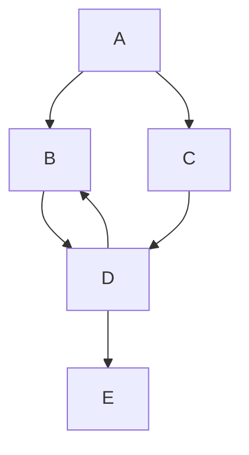
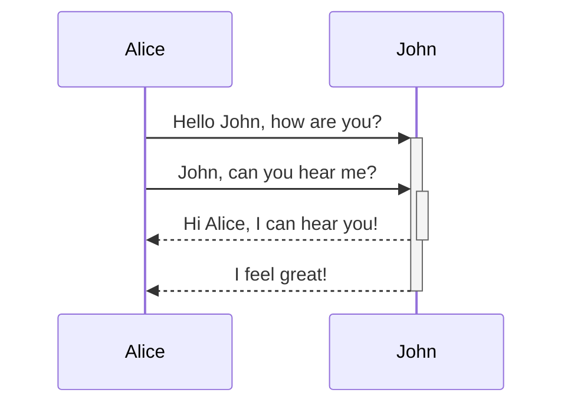

# Mermaid

- [mermaid - Markdownish syntax for generating flowcharts, sequence diagrams, class diagrams, gantt charts and git graphs.](https://mermaid-js.github.io/mermaid/#/)
- [Online FlowChart & Diagrams Editor - Mermaid Live Editor](https://mermaid-js.github.io/mermaid-live-editor/edit#pako:eNpVkM-KwkAMxl8l5OSCfYEeBG3Vi6Cgt46H0InOIPOHdMoibd99p5aF3ZyS7_t9IWTANmjGEp9C0cCtVh5ybZvKiO2So-4ORbEZj5zABc_vEXarY4DOhBitf34t_G6GoBpOM8aQjPWvabGqT_7seYS6OVFMId7_OrfvMMK-sReT1_93jHBOHZoHlQ8qWhKoSD4IrtGxOLI6nz7MisJk2LHCMrea5KVQ-SlzfdSUeK9tCoJlkp7XSH0K17dvf-eFqS3lL7hFnH4ABg5bBA)
- [Diagrams - Material for MkDocs](https://squidfunk.github.io/mkdocs-material/reference/diagrams/)
- [Creating diagrams - GitHub Docs](https://docs.github.com/en/get-started/writing-on-github/working-with-advanced-formatting/creating-diagrams)
- [marmaid.js: How to make lines angular instead of curved](https://mermaid.live/edit#pako:eNpNkEtqw0AMhq8iBMYtOBfwopDYkE1KC82qmSyErWSGZB6M5YZg--4d2xQqbST9nySkARvfMpaYZQMYZ6SEAfLL3T8aTVHyJW36-MMpzDvhsL0Ixxym2bNMuWukoOFYKwfJtqdKR9OJpe4Mm83buGcB6x0_R9i97D102odg3PV15XczBNVwmDEG0cbdplWqlv4PxyPUpwMF8eH8Xzk-_Jj2mU-dxicFC7QcLZk2nTPMpELRbFlhmcKW4k2hclPiqBf_9XQNlhJ7LrAPLQnXhtIxFssL3btU5daIj-_rf5Y3FRjIfXv_x0y_jOhngA)

## entity relationship diagrams

Here is a simple flow chart:

```txt
mermaid
graph TD;
    A-->B;
    A-->C;
    B-->D;
    C-->D;
    D-->E;
```



And here is a network flow diagram:

```txt
mermaid
sequenceDiagram
    Alice->>+John: Hello John, how are you?
    Alice->>+John: John, can you hear me?
    John-->>-Alice: Hi Alice, I can hear you!
    John-->>-Alice: I feel great!
```


