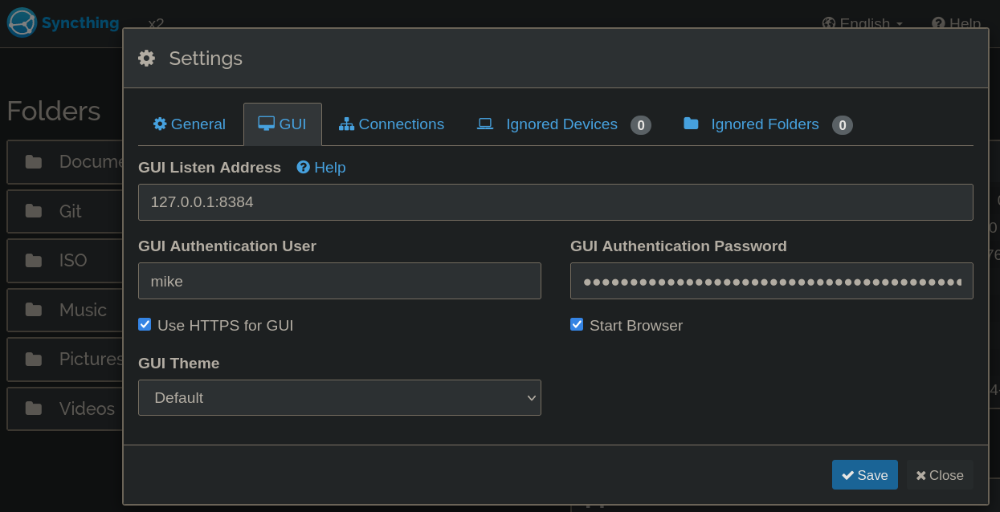

# Syncthing

http://localhost:8384/

- [Syncthing (syncthing.net)](https://syncthing.net/)

> Syncthing is a **continuous file synchronization** program. It synchronizes files between two or more computers in real time, safely protected from prying eyes. Your data is your data alone and you deserve to choose where it is stored, whether it is shared with some third party, and how it's transmitted over the internet.
>
> - [Understanding Synchronization — Syncthing v1.21.0 documentation](https://docs.syncthing.net/v1.21.0/users/syncing#scanning)

- [Is putting a Git workspace in a synced folder really a good idea? (forum.syncthing.net)](https://forum.syncthing.net/t/is-putting-a-git-workspace-in-a-synced-folder-really-a-good-idea/1774)
    - I do it and have had no problems but YYMV.

firewalld:

```shell
sudo firewall-cmd --zone=public --add-service=syncthing --permanent
sudo firewall-cmd --reload
```

## Install

fedora: `sudo dnf install -y syncthing`

ubuntu:

```shell
sudo curl -o /usr/share/keyrings/syncthing-archive-keyring.gpg https://syncthing.net/release-key.gpg
echo "deb [signed-by=/usr/share/keyrings/syncthing-archive-keyring.gpg] https://apt.syncthing.net/ syncthing stable" | sudo tee /etc/apt/sources.list.d/syncthing.list
sudo apt-get update
sudo apt-get install syncthing
```

## Config

Start on boot (gnome):


### web ui

- [https://docs.syncthing.net/users/guilisten.html]

``~/.config/syncthing/config.xml`

```xml
<gui enabled="true" tls="false" debugging="false">
    <address>127.0.0.1:8384</address>
    <apikey>dfjsfdkjhsdfa;hdsfo</apikey>
    <theme>default</theme>
</gui>
```

Be sure to enable HTTPS and set a strong password.


### Systemd start

- <https://docs.syncthing.net/users/autostart.html#using-systemd>

```shell
$ sudo systemctl enable --now syncthing@mike.service
Created symlink /etc/systemd/system/multi-user.target.wants/syncthing@mike.service → /lib/systemd/system/syncthing@.service.
```

## Reset GUI password

- [FAQ — Syncthing documentation](https://docs.syncthing.net/users/faq.html#how-do-i-reset-the-gui-password)

If you’ve forgotten / lost the GUI password, you can reset it using the
--gui-password (and possibly --gui-user) options to the syncthing generate
subcommand. This should be done while Syncthing is not running.

    syncthing cli operations shutdown # Stop Syncthing
    syncthing generate --gui-password=myNewPassword --gui-user=newUserName
    # Restart Syncthing as usual.

