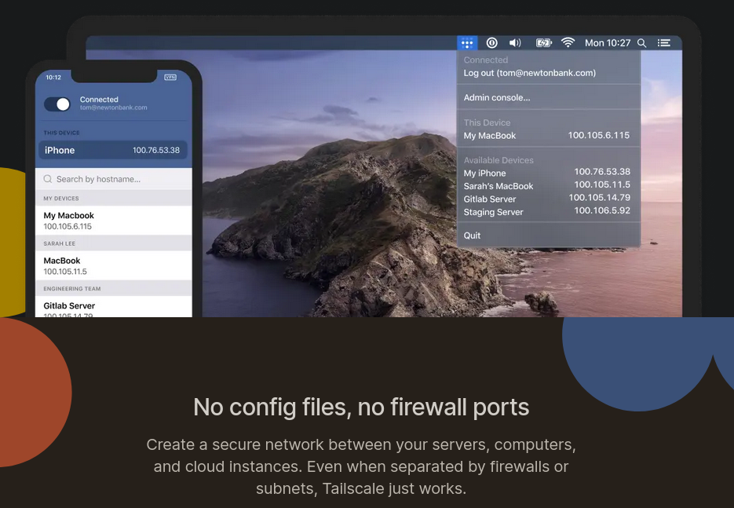

# tailscale

- [Tailscale (tailscale.com)](https://tailscale.com/)
- [How Tailscale works (tailscale.com)](https://tailscale.com/blog/how-tailscale-works/)
- [CLI (tailscale.com)](https://tailscale.com/kb/1080/cli/)



## Install

Find a better way than running downloaded shell script from the web?

- should ideally be signed by someone I trust

```shell
sudo dnf install -y wget
wget https://tailscale.com/install.sh
# read install.sh
sh ./install.sh
sudo tailscale up
```

## firewalld allows all traffic from tailscale

Don't do this unless you understand the implications.

Services on my host already have:

- authentication
- encryption

My Tailscale network provides an extra layer of protection
against compromise by requiring access to it before you
can even try to guess (or use stolen) credentials or observe
traffic that is already encrypted at application layer.

`/etc/firewalld/zones/truted.xml`

```txt
<?xml version="1.0" encoding="utf-8"?>
<zone target="ACCEPT">
  <short>Trusted</short>
  <description>All network connections are accepted.</description>
  <interface name="tailscale0"/>
  <forward/>
</zone>
```

## Bash completion

- [tailscale-bash-completion.sh](tailscale/tailscale-bash-completion.sh)

## Tailscale PING

- [How do I know if my traffic is being routed through DERP? (tailscale.com)](https://tailscale.com/kb/1023/troubleshooting/#how-do-i-know-if-my-traffic-is-being-routed-through-derp)
- [Encrypted TCP relays (DERP)](https://tailscale.com/blog/how-tailscale-works/#encrypted-tcp-relays-derp)

This traffic is going via tailscale server in Sydney:

```shell
$ tailscale ping phone
pong from phone (100.80.90.100) via DERP(syd) in 77ms
pong from phone (100.80.90.100) via DERP(syd) in 106ms
pong from phone (100.80.90.100) via DERP(syd) in 197ms
```

This traffic is going direct between my two hosts:

```shell
$ tailscale ping kida
pong from kida (100.40.32.19) via 192.168.50.12:41641 in 74ms
```

## Check status of other hosts

```shell
$ tailscale status
100.40.32.19    kida       user@        linux   -
100.97.100.78   phonea     user@        iOS     active; relay "syd"
100.99.217.31   kidb       user@        linux   active; direct 192.168.50.12:41641, tx 104132 rx 104396
```

## Check network config and latency

```shell
$ tailscale netcheck

Report:
 * UDP: true
 * IPv4: yes, 131.132.88.122:53237
 * IPv6: no, but OS has support
 * MappingVariesByDestIP: false
 * HairPinning: false
 * PortMapping:
 * Nearest DERP: Sydney
 * DERP latency:
  - syd: 40.5ms  (Sydney)
  - sin: 99.9ms  (Singapore)
  - hkg: 140.2ms (Hong Kong)
  - tok: 145.2ms (Tokyo)
  - lax: 163.5ms (Los Angeles)
  - sfo: 176.1ms (San Francisco)
  - sea: 191ms   (Seattle)
  - den: 199.6ms (Denver)
  - hnl: 209.9ms (Honolulu)
  - dfw: 213.6ms (Dallas)
  - ord: 215.6ms (Chicago)
  - tor: 234.9ms (Toronto)
  - nyc: 241.2ms (New York City)
  - mia: 242.8ms (Miami)
  - fra: 245.1ms (Frankfurt)
  - ams: 254.2ms (Amsterdam)
  - mad: 257ms   (Madrid)
  - par: 264.2ms (Paris)
  - lhr: 273.9ms (London)
  - jnb: 302.2ms (Johannesburg)
  - blr: 308.9ms (Bangalore)
  - sao: 356.9ms (São Paulo)
  - waw: 358.1ms (Warsaw)
  - dbi: 408.4ms (Dubai)
```
