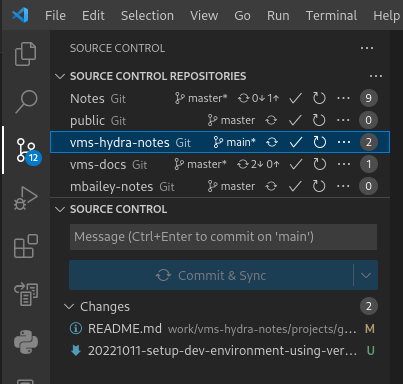

# VSCode

- [Annoyance - Features (including quickopen, git) exclude files based on .gitignore (even if in different folder!)](https://github.com/microsoft/vscode/issues/15604)

## Install

- [Running Visual Studio Code on Linux (code.visualstudio.com)](https://code.visualstudio.com/docs/setup/linux)

Install Key and Yum repo:

```shell
sudo rpm --import https://packages.microsoft.com/keys/microsoft.asc
sudo sh -c 'echo -e "[code]\nname=Visual Studio Code\nbaseurl=https://packages.microsoft.com/yumrepos/vscode\nenabled=1\ngpgcheck=1\ngpgkey=https://packages.microsoft.com/keys/microsoft.asc" > /etc/yum.repos.d/vscode.repo'
```

Then update the package cache and install the package using dnf (Fedora 22 and above):

```shell
dnf check-update
sudo dnf install code
```

## Settings

File locations:

- `~/.config/Code/User`
- `~/.config/Code/Workspaces`
- `~/.vscode`
    - `argv.json` : pass permanent command line arguments to VS Code.
    - `extensions`: your extensions live here

View the default values in the Settings editor or see a read-only version of the [`defaultSettings.json`][defaults] via **Preferences: Open Default Settings (JSON)**

My preferred settings:

| Setting  ID              | Value   | Comment                                          |
| ------------------------ | ------- | ------------------------------------------------ |
| git.rebaseWhenSync       | true    | Always use rebase instead of merge when running. |
| files.insertFinalNewline | true    | Insert final newline into file when saving       |

[defaults]: https://code.visualstudio.com/docs/getstarted/settings#_default-settings

## Extensions

Install:

    code --install-extension vscodevim.vim

### List

```shell
$ code --list-extensions
DavidAnson.vscode-markdownlint
aws-scripting-guy.cform
bierner.markdown-mermaid
csholmq.excel-to-markdown-table
donjayamanne.githistory
eamodio.gitlens
ms-python.pylint
ms-python.python
ms-python.vscode-pylance
ms-vscode.makefile-tools
mushan.vscode-paste-image
pharndt.vscode-markdown-table
redhat.vscode-yaml
sidthesloth.html5-boilerplate
telesoho.vscode-markdown-paste-image
timonwong.shellcheck
vscodevim.vim
wholroyd.jinja
yzhang.markdown-all-in-one
```

Had these but didn't keep:

```
almenon.arepl
batisteo.vscode-django
BillDietrich.linkcheckerhtml
bung87.rails
bung87.vscode-gemfile
donjayamanne.python-environment-manager
donjayamanne.python-extension-pack
esbenp.prettier-vscode
frhtylcn.pythonsnippets
golang.go
kddejong.vscode-cfn-lint
KevinRose.vsc-python-indent
kiteco.kite
loganarnett.lambda-snippets
ms-azuretools.vscode-docker
ms-toolsai.jupyter
ms-toolsai.jupyter-keymap
ms-toolsai.jupyter-renderers
ms-toolsai.vscode-jupyter-cell-tags
ms-toolsai.vscode-jupyter-slideshow
ms-vsliveshare.vsliveshare
ms-vsliveshare.vsliveshare-audio
ms-vsliveshare.vsliveshare-pack
njpwerner.autodocstring
rebornix.ruby
shd101wyy.markdown-preview-enhanced
sianglim.slim
VisualStudioExptTeam.intellicode-api-usage-examples
VisualStudioExptTeam.vscodeintellicode
wingrunr21.vscode-ruby
```

## Shortcuts

```txt
Ctrl-p-p: Go back to previous file
```

## Git

- Opening multiple repos allows for a great Git status summary view
- Click on the repo to see only those changes below



## GUI

Open two terminals with horizontal split:

- Open a first terminal
- Open a second one
- Right click a terminal and select "move to editor area"

## Troubleshooting

### File watchers

- [Visual Studio Code is unable to watch for file changes in this large workspace" (error ENOSPC)](https://code.visualstudio.com/docs/setup/linux#_visual-studio-code-is-unable-to-watch-for-file-changes-in-this-large-workspace-error-enospc)


Check your watcher limits, current usage and how to increase the limits for [inotify](inotify.md)

```json

Maybe exclude some from vscode watchers:
```json
"files.watcherExclude": {
    "**/.git/objects/**": true,
    "**/.git/subtree-cache/**": true,
    "**/node_modules/*/**": true
  }
```
