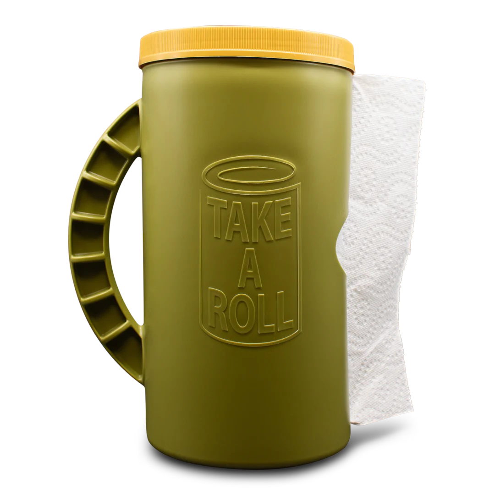
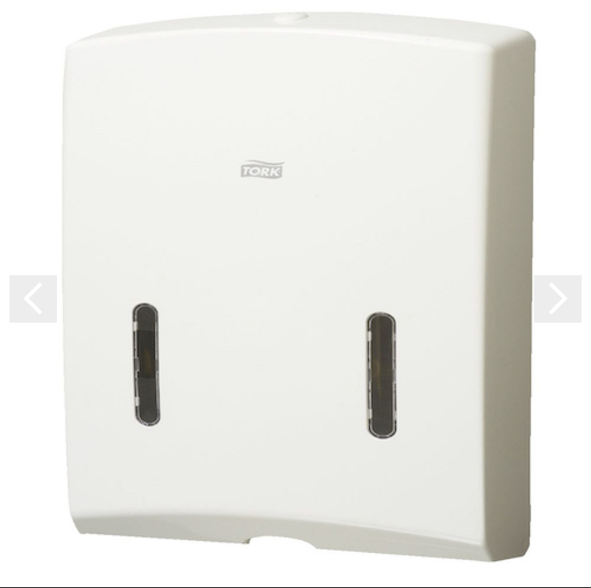
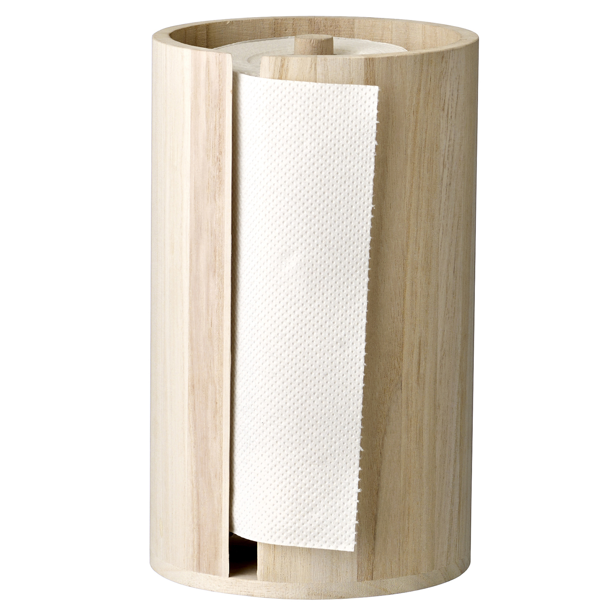
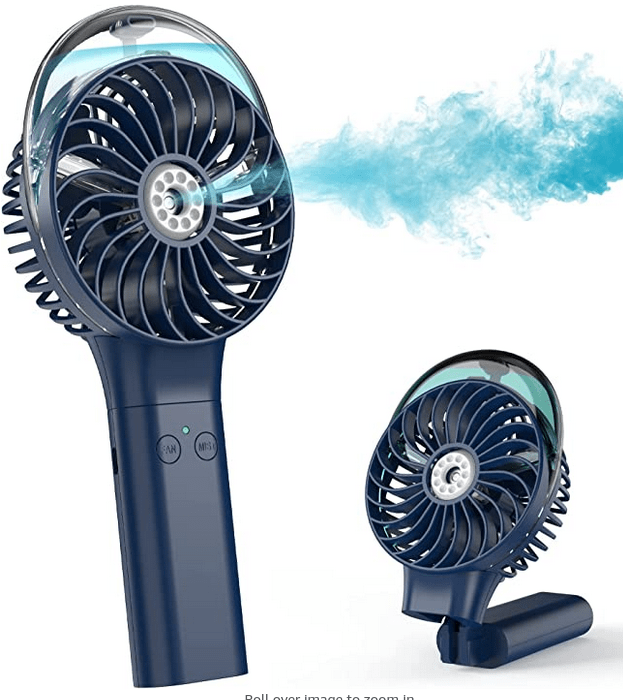

# work from outdoors

Ideas for Working From Outdoors.

## General Considerations

- Laptop
    - switch off system "dark mode"
        - configure your apps to adapt to system
    - use one with a bright screen?
    - large enough display
    - second screen?
- glare / reflection
    - choose a dark/shaded background to reduce contrast around screen
    - avoid light source (e.g. sun or bright reflective surface) behind

## Carrying thingy

Have it at the ready so you don't need to gather too many things before going outside.

- milk crate
    - organise with dividers, containers

## Internet

- phone tethering
    - automatic
        - why does iphone wifi not appear on my photo automatically?
- wifi
    - boost / direct / repeat wifi
        - battery option?

## Lap Desk

- [Why you need a 'lap desk' (and how to pick the best one) - PC World Australia (www.idgcdn.com.au)](https://www.idgcdn.com.au/article/688550/)

- [Lap Desk - Portable Laptop Desk with Device Ledge, Mouse Pad and Phone Holder , Fits up to 15.6inch Laptop Tablet Black Laptop Stand for Home Office Writing Desk and Drawing  Amazon.com.au Computers (www.amazon.com.au)](https://www.amazon.com.au/dp/B09C1JSM5B?smid=A2TL2DM2M3366A&ref_=chk_typ_imgToDp&th=1)

## Paper Towel Holder

- [Take a Roll](https://therollgear.com/products/take-a-roll-spring)

[Tork Ultraslim Multifold Mini Hand Towel Dispenser H4 White (2320729)](https://www.splitboxes.com.au/tork-ultraslim-multifold-mini-hand-towel-dispenser-h4-white-2320729/)

Dimensions: 275mm width x 280mm height x 80mm depth

Slim, comtemporary design, lockable with viewing window

https://img.zcdn.com.au/lf/8/hash/38312/19143448/4/Nature+Kitchen+Paper+Roll+Stand.jpg

## Outdoor office chair

- fishing chair?

### Swing chair

- shade
- shelter
- mount points
- storage

## Table

# Backpack

## USB C Laptop Powerbank

[Lenovo Go USB-C Laptop Power Bank (Thunder Black)  Lenovo AU (www.lenovo.com)](https://www.lenovo.com/au/en/p/accessories-and-software/chargers-and-batteries/power-banks/40allg2www?orgRef=https%253A%252F%252Fwww.google.com%252F)

- Passthrough charging
- Built in USB-C cable

## Laptop Dome tent

Probably don't need this.

## Fan

- [Amazon COMLIFE Handheld Misting Fan  ReviewDemo + Coupon! - YouTube (www.youtube.com)](https://www.youtube.com/watch?v=VvngNlhFVkQ)
- [Portable Handheld Misting Fan, 3000mAh Rechargeable Mist Fan- Up to 10h Cooling & 1h Misting, Battery Operated Spray Fan for Travel, Home Office, Camping, Outdoors  Amazon.com.au Computers (www.amazon.com.au)](https://www.amazon.com.au/dp/B07DKZZDVP?smid=A263RZIEXPWYR1&ref_=chk_typ_imgToDp&th=1)

